# Background Estimation

## Objective

Summarize the current Run-3 2024 2DAlphabet background model, the completed
transfer-function scan, and the checks still required before the model is
frozen.

## Method Summary

The dominant background is QCD multijet production. QCD is derived from data
with a pass/fail construction, while SM `ttbar` is included from simulation.

| Component | Role |
| --- | --- |
| Fail region | QCD-enriched control sample |
| Pass region | Signal-like sample after the top-tag requirement |
| Top-candidate mass sidebands | Constrain the fail-to-pass behavior outside the signal window |
| Transfer function, \(R_{\mathrm{p/f}}(x,y)\) | Maps the fail-region QCD model into the pass region |
| SM `ttbar` | Simulated background included in the fit |
| Signal template | `signalRSGluon4000`, used to construct a standard signal-plus-background card |

The 2024 binning has 11 top-candidate-mass intervals and 15
\(m_{t\bar{t}}\) intervals. Central and forward rapidity categories are fitted
separately.

## Current 2024 Implementation

| Item | Current state |
| --- | --- |
| Categories | `cen2024`, `fwd2024` |
| Candidate forms | `0x0`, `0x1`, `0x2`, `1x0`, `1x1`, `1x2`, `2x1`, `2x2` |
| Fit areas | 16 total: eight forms in each category |
| Pairwise outputs | 25 stored comparisons per category; equal-parameter pairs are skipped |
| Postfit projections | Available for every tested candidate |
| **Selected nominal order** | **Central `2x1`; forward `2x1`** (F-test selected) |
| Final model-selection status | **Selected and passing goodness-of-fit** (blinded); see below |

### Selected transfer-function order (2026-06-18)

The F-test selects **`2x1` for both the central and forward categories**: going
from `1x1` to `2x1` is strongly preferred, while going from `2x1` to `2x2` is
not. `jsons/TransferFunctions.json` is set to `cen2024 = 2x1`, `fwd2024 = 2x1`.

| Comparison | Central | Forward |
| --- | --- | --- |
| `1x1` → `2x1` | preferred (F = 14.8, p ≈ 0.000) | preferred (F = 12.2, p = 0.001) |
| `2x1` → `2x2` | not preferred (F = 0.07, p = 0.79) → stop | not preferred (F = 0.09, p = 0.77) → stop |

| Central: `1x1` → `2x1` | Central: `2x1` → `2x2` |
| --- | --- |
| 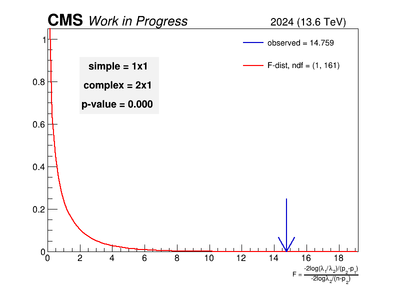 |  |

| Forward: `1x1` → `2x1` | Forward: `2x1` → `2x2` |
| --- | --- |
| 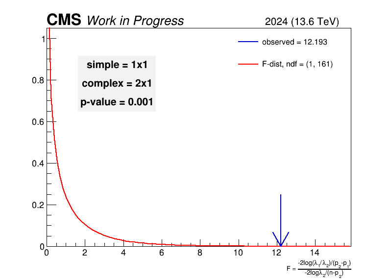 | 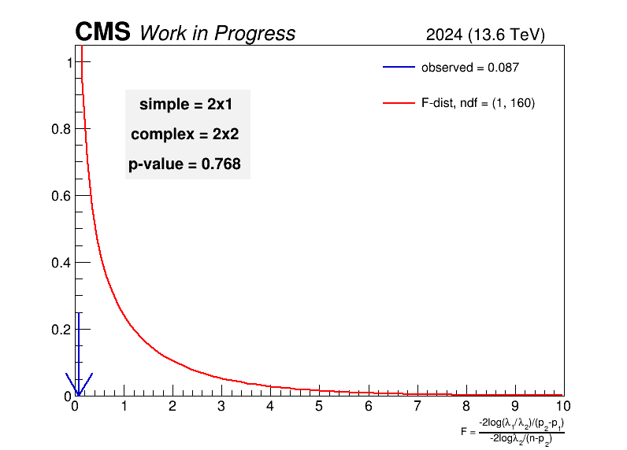 |

### Fit configuration notes

- Luminosity 109.95 fb⁻¹ (13.6 TeV, golden JSON).
- Signal strength restricted to **r ≥ 0** with initial value **r = 0** (allowing
  negative r or starting at r = 1 caused fit-stability failures).
- A **clamp-to-data** floor is applied to empty / sub-event QCD cells; this is
  what allows the forward fit to pass goodness-of-fit.
- 2024 top-tag scale factor is a **placeholder (0.90/tag)** pending a measured
  GloParT-v3 value.

The scan varies polynomial order within the existing 2D transfer-function
construction. It does **not** test unrelated functional families such as
Laurent, exponential, or Chebyshev functions.

## Reproducing The Scan

Run from the standalone `bgestimation/` area in the compatible
CMSSW/2DAlphabet environment:

```bash
cd /uscms_data/d3/amandal2/bg_ttbar/CMSSW_14_1_0_pre4/src/bgestimation

LOCAL_INPUT="/eos/user/a/amandal/ttbarhad_root_files/2dAlphabetInputs"

python -u fit_ftest.py \
  --preset 2024 \
  --input "$LOCAL_INPUT" \
  --signal RSGluon4000 \
  2>&1 | tee output_ftest_2024.log

python -u results_ftest.py \
  --preset 2024 \
  --signal RSGluon4000 \
  2>&1 | tee output_ftest_results_2024.log
```

The work areas are written under:

```text
ftest/2024/{cen,fwd}/ttbarfits_{cen,fwd}2024_ftest<TF>/
```

The numerical summaries and pairwise plots are written under:

```text
ftest_results/
```

Preserve each work area's `runConfig.json`, card, GOF ROOT file, and fit logs.
The current launcher updates the selected config's input path and signal list
before constructing the fit; `runConfig.json` is the fit-specific record.

## F-test Summary

The stored CSV tables contain the simple and complex candidate labels, parameter
counts, the bin count used by the script, observed F statistic, and p-value.
Rows with `p < 0.05` are highlighted in red in the presentation tables.

The raw output contains 11 central and 6 forward rows with `p < 0.05`. This
count includes all unequal-parameter pairings and is not itself a model-choice
criterion.

### Central tables

| | |
| --- | --- |
|  |  |
|  | |

### Forward tables

| | |
| --- | --- |
|  |  |
|  | |

### Example pairwise plots

| Central: `0x0` versus `0x1` | Forward: `0x0` versus `0x1` |
| --- | --- |
|  |  |

## Goodness of Fit

Saturated goodness-of-fit, background-only, with the top-mass signal window
masked (blinded), 200 toys, at the selected `2x1` order. The observed test
statistic (blue arrow) sits inside the toy distribution in both categories, so
the background model describes the data well.

| Central `2x1` — p = 0.485 | Forward `2x1` (clamp-to-data) — p = 0.180 |
| --- | --- |
| 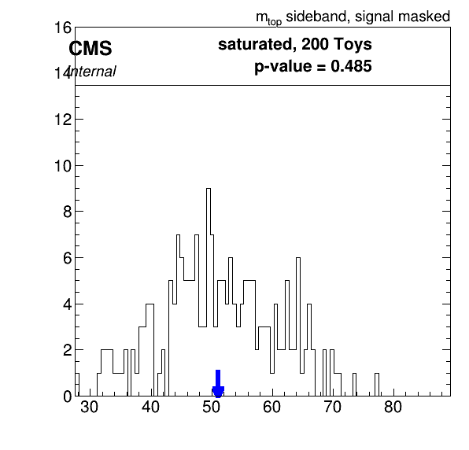 | 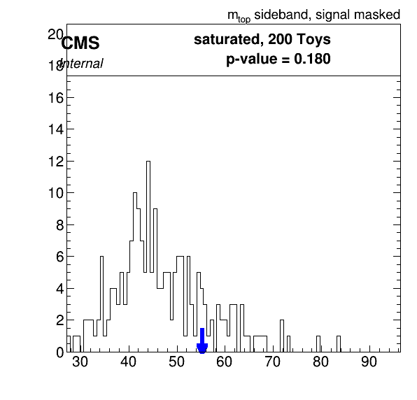 |

## Transfer Function

The transfer function maps the fail-region QCD model into the pass region. Both
categories use the order

$$R_{\mathrm{p/f}}(m_t, m_{t\bar t}) = (a + b\,m_t + c\,m_t^2)\,(1 + d\,m_{t\bar t}).$$

Fitted parameters (background-only fit, normalized coordinates):

| Parameter | 2024 central | 2024 forward |
| --- | --- | --- |
| a | 3.61 ± 0.83 | 3.82 ± 0.82 |
| b | 16.57 ± 10.91 | 23.75 ± 13.02 |
| c | −16.25 ± 13.42 | −29.90 ± 16.34 |
| d | 1.01 ± 1.23 | −0.52 ± 0.26 |

### Fail-region QCD (transfer-function input)

| Central | Forward |
| --- | --- |
| 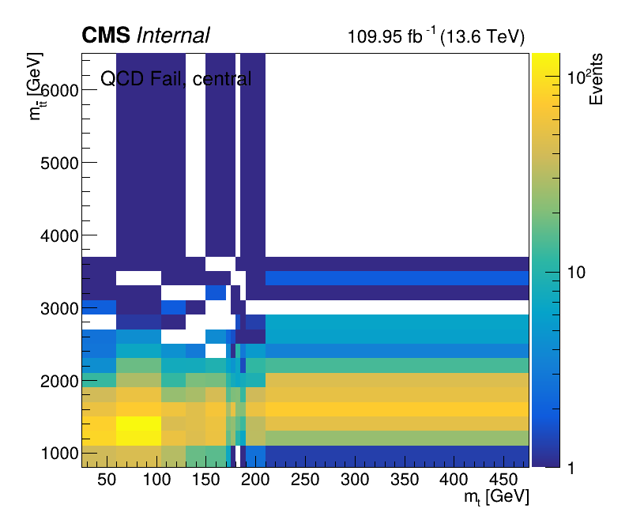 | 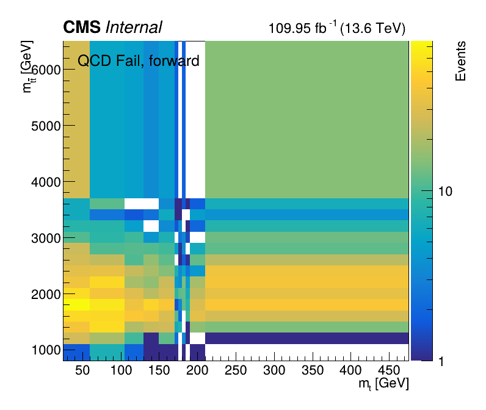 |

### Pass-region QCD, prefit vs postfit

The prefit pass estimate (initial transfer function, signal window masked) is
sparse; after the fit the data-driven QCD estimate is smooth across the plane.

| Central prefit | Central postfit |
| --- | --- |
| 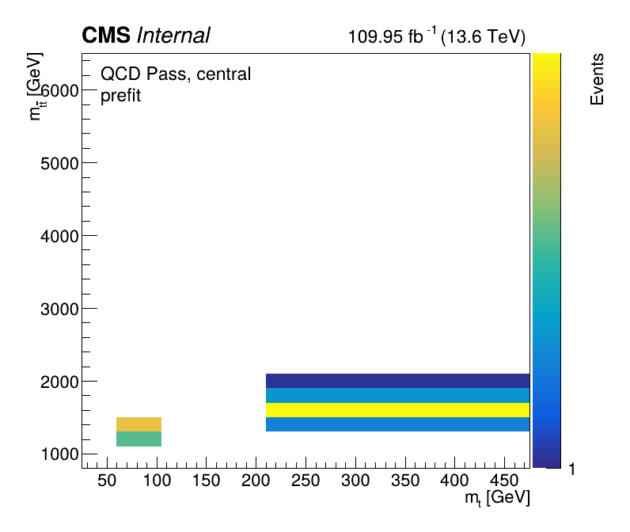 | 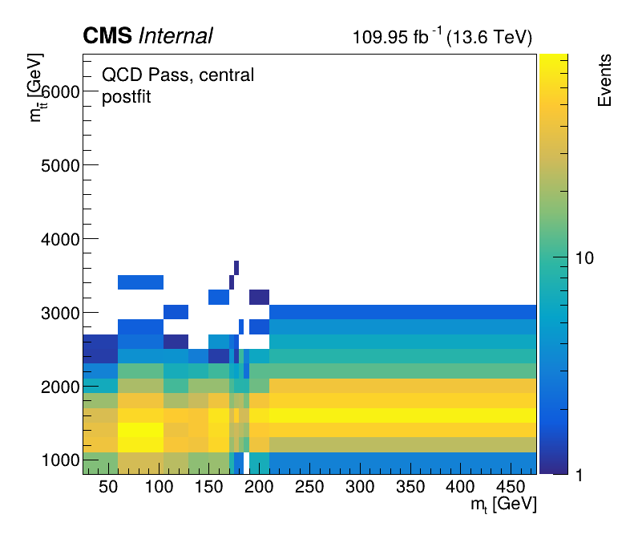 |

| Forward prefit | Forward postfit |
| --- | --- |
| 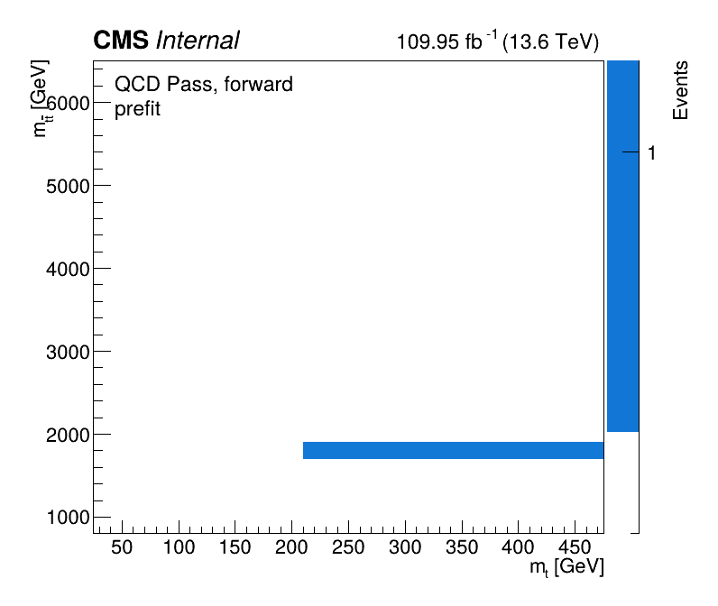 | 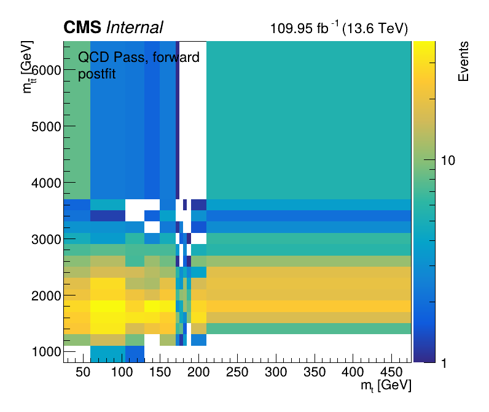 |

## Statistical Interpretation

!!! warning "The scan is provisional"
    The standard F-test interpretation assumes nested models. The current
    implementation orders candidates by parameter count and compares every pair
    with different counts. Some stored pairs are not obviously nested. Use
    non-nested rows as diagnostics, not calibrated model-selection p-values.

Before freezing the model:

1. Define the allowed nested comparison graph.
2. Validate the effective number of fitted bins and degrees of freedom.
3. Confirm the treatment of blinded pass-region signal-window bins.
4. Check fit convergence, nuisance pulls, and correlations for retained models.
5. Use postfit residuals and closure checks alongside the F-test.

The current CSVs use `n_bins = 165`, corresponding to \(11\times15\). The
implementation should be reviewed to confirm whether the pass/fail region count
and blinded bins are represented consistently with the intended F-test
definition.

An F statistic of zero is written when the nominally more complex candidate
does not improve the saturated GOF value. Such a row appears as `p = 1`; this
does not by itself mean the fit failed.

## Postfit \(m_{t\bar{t}}\) Projections

Each source page contains six background-only projections: pass and fail
regions for the low, signal-window, and high top-candidate-mass intervals.

### Selected-order projections (corrected labels)

Final background-only postfit projections at the selected `2x1` order, with the
luminosity/energy label corrected to `109.95 fb⁻¹ (13.6 TeV)`. The pass
signal-window panel has no data points (blinded).

| Central `2x1` | Forward `2x1` |
| --- | --- |
|  |  |

## Presentation Downloads

- [All pairwise F-test plots](../assets/analysis/background-estimation/2024/pdfs/FTest_pairwise_results_2024.pdf)
- [F-test numerical tables](../assets/analysis/background-estimation/2024/pdfs/FTest_summary_tables_2024.pdf)

## Current Takeaway

The 2024 background model is selected and validated (blinded): the F-test
chooses **`2x1` for both central and forward**, and the saturated
goodness-of-fit passes in both categories (cen p = 0.485, fwd p = 0.180 with
clamp-to-data). Transfer-function parameters, prefit/postfit pass-region QCD,
and corrected-label postfit projections are documented above. Downstream
blinded limits and impacts are on the [Results](results.md) page.

Remaining work is physics inputs and unblinding, not the background method.

## Open Items

- Replace the placeholder 2024 top-tag scale factor (0.90/tag) with a measured
  GloParT-v3 value.
- Add nuisance pull/correlation summaries to the documentation (impacts are on
  the Results page).
- Confirm `n_bins` / blinded-bin accounting in the F-test bookkeeping.
- Proceed to observed limits and full systematics once approved to unblind.
