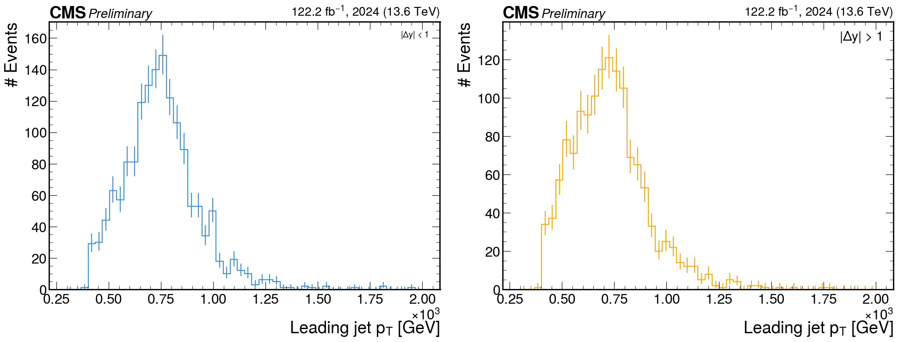

# Data/MC Validation

## Objective

Track the validation plots and status used to decide whether the current
analysis configuration is ready for background estimation and results.

## Core Plot Set

| Observable | Why it matters |
| --- | --- |
| Leading AK8 soft-drop mass | Checks top-candidate mass modeling and sideband behavior |
| Subleading AK8 soft-drop mass | Checks the second candidate and pass/fail category stability |
| `m_tt` | Main resonance-sensitive spectrum |
| HT | Validates event-activity modeling and trigger plateau assumptions |
| Jet rapidity or eta | Checks central/forward category behavior |
| Delta rapidity | Directly validates central/forward category split |

## Status Matrix

| Region | Current status | Notes |
| --- | --- | --- |
| Fail/control central | To fill | Main QCD-dominated validation region |
| Fail/control forward | To fill | Forward-region modeling check |
| Pass/signal-like central | To fill | Review after background strategy is stable |
| Pass/signal-like forward | To fill | Review after background strategy is stable |

## Current Takeaway

Validation should be summarized as a small set of stable plots plus a clear
watchlist, rather than a dump of every diagnostic figure.

## Open Items

- Add current Data/MC figures for the standard plot set.
- Add pass/watchlist/follow-up labels after the next validation pass.
