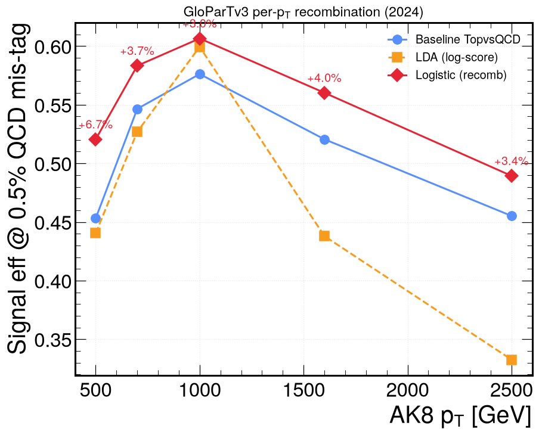
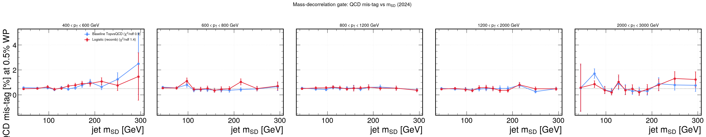

# GloParT-v3 recombination top-tagger

An alternative boosted-top tagger that replaces the hand-built baseline ratio with
a **learned, per-$p_T$ recombination** of the raw GloParT-v3 class heads. It gives
a higher signal efficiency at the **same** QCD mis-tag, while staying decorrelated
from jet mass (the entry ticket for 2DAlphabet). It is opt-in
(`--toptagger recomb`); the baseline path is unchanged by default.

## Method

The baseline tagger collapses the heads into one fixed ratio,

$$D_{\mathrm{top}} = \frac{P_{\mathrm{TopbWqq}} + P_{\mathrm{TopbWq}}}{P_{\mathrm{TopbWqq}} + P_{\mathrm{TopbWq}} + P_{\mathrm{QCD}}}.$$

Its $1\!:\!1$ `TopbWqq:TopbWq` mix and QCD-only denominator are $p_T$-independent
choices that become sub-optimal as the top boosts and a prong leaks out of the AK8
cone. The recombination instead learns a **per-$p_T$ logistic combination** of the
log-scores of the seven heads (`TopbWqq, TopbWq, QCD, Xqq, Xcs, Xbb, Xcc`) plus the
hadronic-top sum and the heavy-flavour-$X$ sum:

$$s(\mathrm{jet}) = \sigma\!\Big(B_0(p_T) + \sum_k A_k(p_T)\,\log(\mathrm{head}_k + \varepsilon)\Big),$$

i.e. a learned, $p_T$-dependent weighted-geometric combination of the heads.
Versus the baseline it keeps the top-vs-QCD core but adds weight on the **$X$
(heavy-flavour) heads** and an asymmetric `TopbWqq:TopbWq` split — that extra
information is the gain. Coefficients are fit by class-balanced logistic regression
(IRLS) per $p_T$ bin; the heads are **not** a softmax (they don't sum to 1 and can
exceed 1), so log-scores are used rather than logits.

The fit was done on 2024 NanoAOD-v15 with full statistics: the xs-weighted QCD
multijet background (8 $p_T$-binned samples) and Z′→$t\bar t$ resonance tops as the
signal (the search-relevant boosted tops; SM $t\bar t$ tops are too soft and
under-represent the gain). Training/evaluation are split by event parity.

## Working points (mis-tag nomenclature)

Working points follow the **standard CMS AK8 top-tagger targeted QCD mis-tag**,
held flat in every $p_T$ bin:

| WP | targeted QCD mis-tag |
| --- | --- |
| `verytight` | 0.1% |
| **`tight`** | **0.5%** |
| `medium` | 1.0% |
| `loose` | 2.5% |
| `veryloose` | 5.0% |

The analysis operates at **0.5% (tight)**. Because the recombined score is
$p_T$-dependent, the working point is a **per-$p_T$ threshold** (not a single
scalar). For a like-for-like comparison the baseline is also re-cast as per-$p_T$
thresholds on $D_{\mathrm{top}}$ at the same flat mis-tag. The deployed 0.5%
thresholds (2024):

| $p_T$ bin [GeV] | baseline $D_{\mathrm{top}}$ | recombination $s$ |
| --- | --- | --- |
| 400–600 | 0.918 | 0.956 |
| 600–800 | 0.913 | 0.956 |
| 800–1200 | 0.912 | 0.955 |
| 1200–2000 | 0.919 | 0.960 |
| 2000–3000 | 0.919 | 0.963 |

These per-$p_T$ thresholds (the new tagger operating points) are stored in
`data/recomb/{baseline,recomb}_deploy_2024.json` and applied in the processor;
they replace the single global scalar of the legacy baseline. The tagger has no
central data/MC scale factor — its efficiency SF is **floated in the bump-hunt /
2DAlphabet fit**.

## Improvement

At a fixed **0.5% QCD mis-tag per $p_T$ bin** (held-out), the recombination raises
the signal (boosted-top) efficiency across the whole boosted regime:

| $p_T$ bin [GeV] | baseline eff | recombination eff | gain |
| --- | --- | --- | --- |
| 400–600 | 0.45 | 0.52 | **+6.7%** |
| 600–800 | 0.55 | 0.58 | **+3.7%** |
| 800–1200 | 0.58 | 0.61 | **+3.0%** |
| 1200–2000 | 0.52 | 0.56 | **+4.0%** |
| 2000–3000 | 0.46 | 0.49 | +3.4% |

**Mean +3–4% absolute signal efficiency at the same QCD mis-tag.** A Gaussian-LDA
cross-check stays at/below baseline (the log features are non-Gaussian), so the
logistic fit is the one used.



## Mass decorrelation

The gain is only admissible for 2DAlphabet if the recombined score does not sculpt
the QCD mass spectrum. At each working point the QCD mis-tag is measured in bins of
jet $m_{\mathrm{SD}}$: the recombination is **as flat as the baseline** in every
$p_T$ bin (constant-fit $\chi^2/\mathrm{ndf}\sim\mathcal{O}(1)$, negligible slope),
so the efficiency gain is not bought by carving the QCD mass peak.



## Usage

```bash
# recombination tagger at 0.5% mis-tag
python ttbaranalysis.py --iov 2024 --dataset TTbar --ttagWP tight --toptagger recomb
# matched baseline (per-pT thresholds at the same flat 0.5%) for comparison
python ttbaranalysis.py --iov 2024 --dataset TTbar --ttagWP tight --toptagger deepak8 --ttag-ptbinned
```

Outputs are tagged `_recomb` / `_ptbin`. Full study, code, and reproduction:
`TTbarHadronicSkimmer` (`glopart_recomb_SUMMARY.md`).
