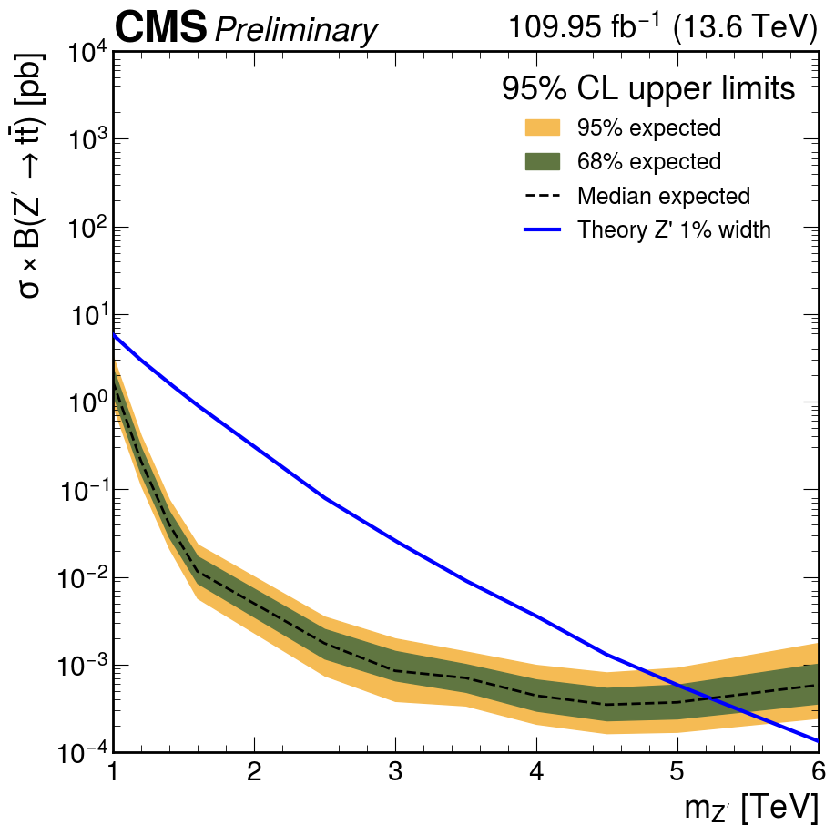
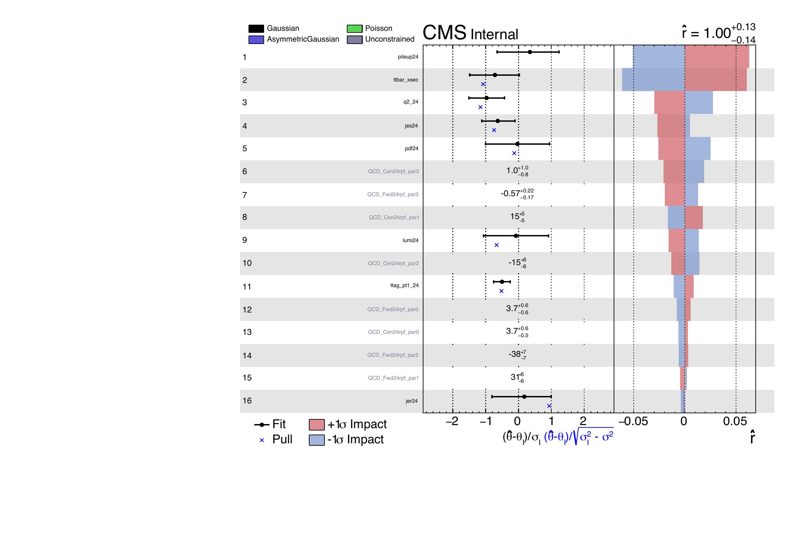

# Results

## Objective

Collect result-facing material only after selections, validation, background
estimation, and systematic assumptions have a stable reviewed configuration.

!!! info "Blinded expected result (2026-06-18)"
    First end-to-end 2024 result: combined central + forward, transfer-function
    order `2x1`, **blinded** (expected-only). Dataset 109.95 fb⁻¹ (13.6 TeV),
    ZPrime → t̄t at 1% width.

## Current Status

| Input | Status |
| --- | --- |
| 2024 background fit | Central and forward, order `2x1`, passing goodness-of-fit |
| Transfer-function choice | **Selected: central `2x1`, forward `2x1`** (F-test) |
| Combined limit | **Blinded expected, available below** |
| Impacts | Blinded Asimov, available below |
| Systematic inputs | Placeholder 2024 top-tag SF (0.90/tag); to be measured |
| Observed result | **Not unblinded** |

## Blinded Expected Limits

Combined central + forward 95% CL upper limits on the ZPrime (1% width)
production cross section, blinded (expected median and ±1σ/±2σ bands). The
theory crosses the median expected limit at **≈ 5.32 TeV**, i.e. the expected
exclusion reach is about 5.3 TeV.

| Quantity | Value |
| --- | --- |
| Signal | ZPrime → t̄t, 1% width |
| Categories | central + forward, combined |
| Transfer function | `2x1` (both) |
| Mass range | 1–6 TeV (m_tt window ends at 6.5 TeV) |
| Expected exclusion | ≈ 5.32 TeV (+0.28 / −0.32) |
| Blinding | blinded (expected only) |

!!! note "Mass coverage"
    The 1.8 and 2.0 TeV points are omitted (point-specific instability in the
    asymptotic −2σ band) and will be recovered with toy-based limits. Masses
    above ~6.5 TeV are outside the m_tt fit window.

## Impacts

Nuisance-parameter impacts on the signal strength (blinded Asimov, 3 TeV
benchmark). The fit recovers r̂ ≈ 1.00 ± 0.13; the t̄t cross section and pileup
lead, with the transfer-function parameters contributing moderately — the
result is statistics / background-estimation dominated.

## Readiness Conditions

Before adding result distributions or limits:

1. Freeze the central and forward transfer-function choices.
2. Validate the nested F-test comparisons and degrees of freedom.
3. Correct 2024 luminosity and collision-energy labels in fit plots.
4. Complete closure, GOF, fit-quality, and nuisance checks.
5. Confirm the systematic model and the intended blinding/unblinding state.
6. Record the exact input production and saved `runConfig.json` files.

## Result Presentation

Each future result entry should state:

- configuration and production date;
- dataset and luminosity;
- category or combination;
- transfer-function choice and justification;
- systematic model;
- blinding state;
- whether the figure is work in progress, under review, or approved.

## Current Takeaway

The 2024 analysis has a complete **blinded** result chain: selected `2x1`
transfer functions, passing goodness-of-fit, a combined expected limit reaching
**≈ 5.3 TeV**, and a well-behaved impact ranking. Remaining before a final
result: a measured 2024 top-tag scale factor, recovery of the 1.8/2.0 TeV
points, full systematics, and unblinding approval.
