# Run-3 Top Tagger And QCD Sample Follow-Up

## Date

2026-04-16

## Source

`research-notes/meetings/ttbarhad/2026/04/meeting_2026_04_16_thu.md`

## Presented

- QCD dataset question for the Run-3 workflow.
- Observation that pass/fail scores had not been updated from Run 2.
- GlobalParT3 discriminator definition from the CMS Twiki.
- Full 2024 data plots made with old tagger cuts as a pre-fix reference.
- Low-stat QCD plots, likely affected by the same tagger/score issue.

## Figures

### GlobalParT3 Definition

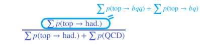

### Full 2024 Data, Old WP Reference

These plots were made with the old, probably wrong, Run-2-style pass/fail
thresholds. They are useful as a pre-fix reference, not as validation plots for
the corrected Run-3 tagger setup.

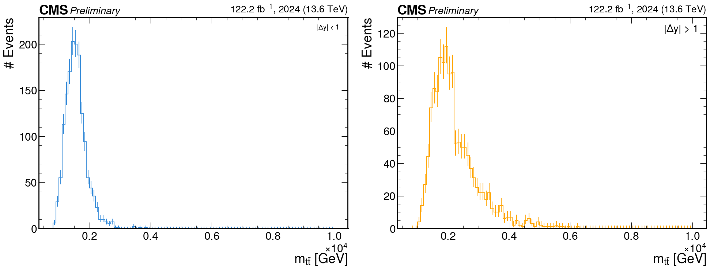

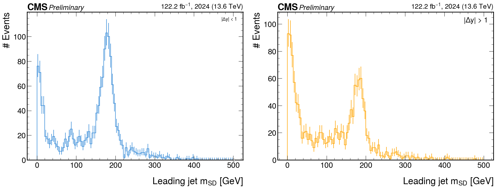

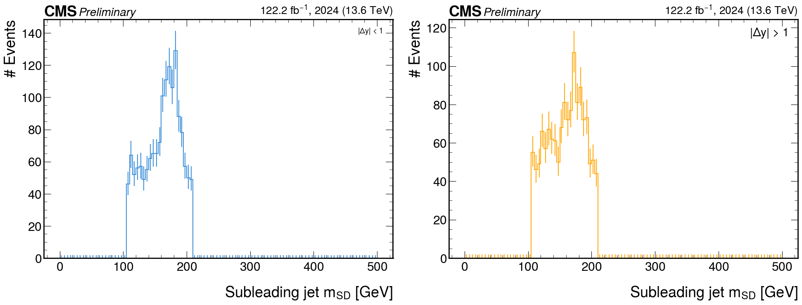

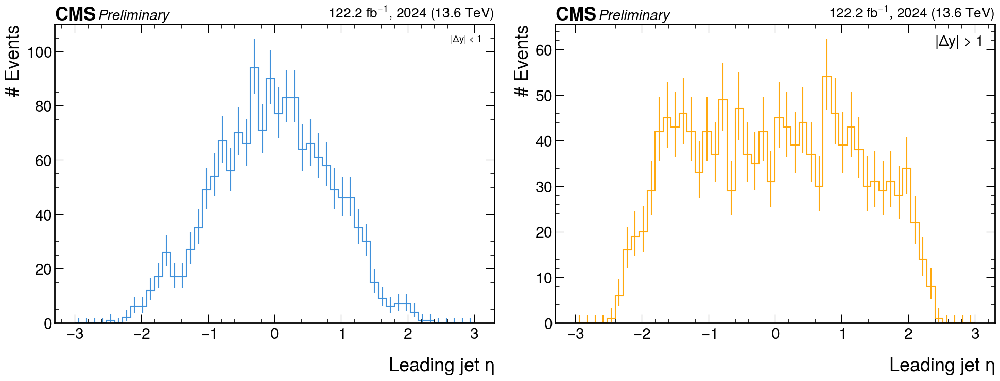

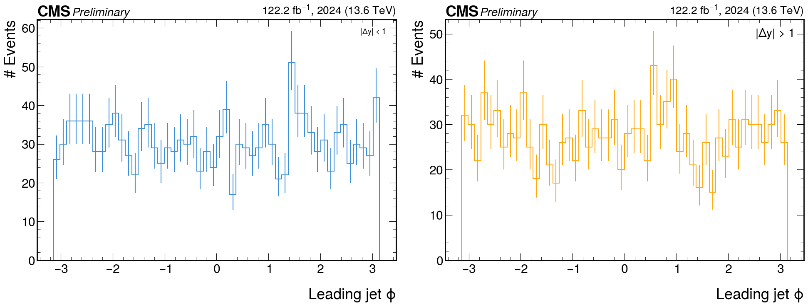

### Low-Stat QCD Reference

These QCD plots were noted as very low-stat and likely affected by the same
pass/fail tagger issue.

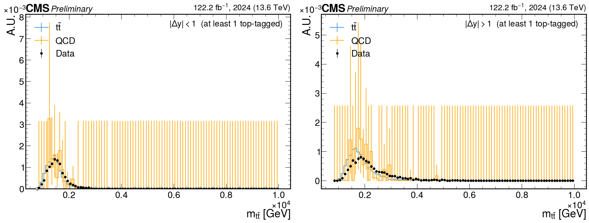

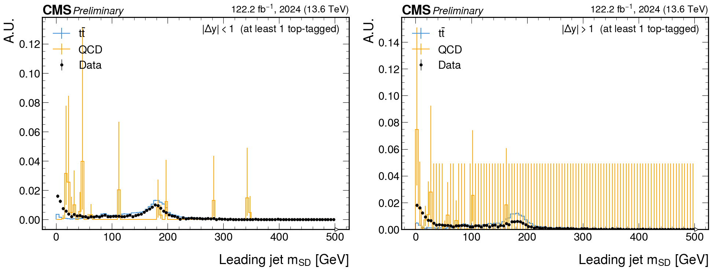

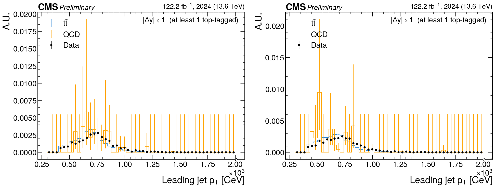

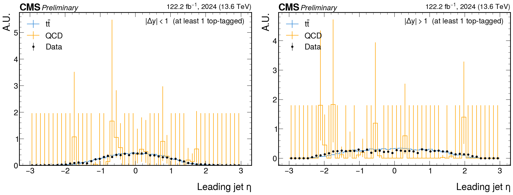

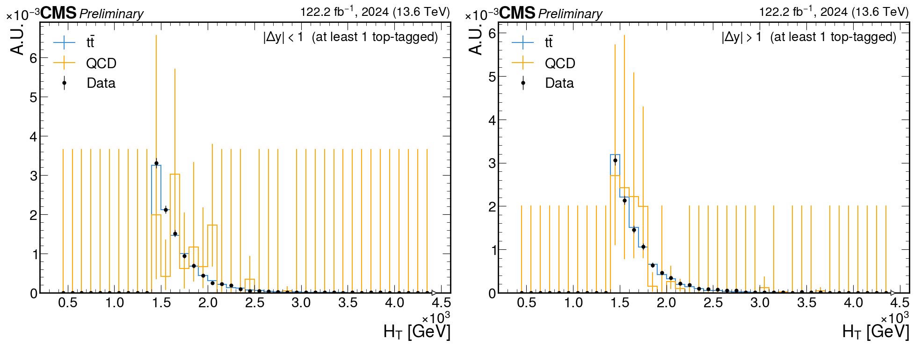

## Decisions And Requests

- Treat the old-WP full-2024 data plots as pre-fix reference only.
- Look at FastSIM.
- Check pT-binned QCD samples.
- Consider QCD datasets matching:
  `/QCD_Bin-PT_/RunIII2024Summer24NanoAODv15_150X_mcRun3_2024_realistic_v2*/NANOAODSIM`

## Action Items

| Item | Status |
| --- | --- |
| Update pass/fail scoring for Run-3 GlobalParT3 definitions | In progress |
| Re-run event counts after corrected WP thresholds | Open |
| Reproduce data plots with corrected tagger cuts | Open |
| Re-check QCD statistics after tagger fix | Open |
| Investigate FastSIM and pT-binned QCD samples | Open |
