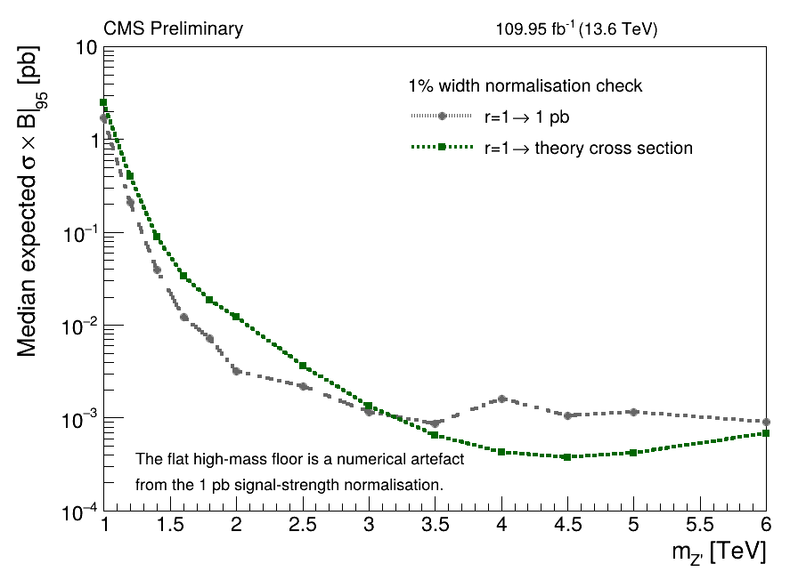
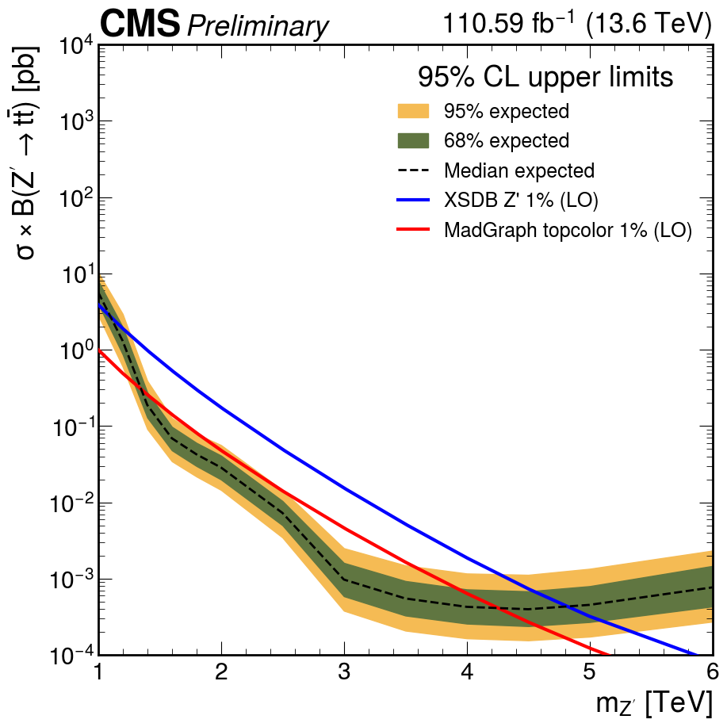
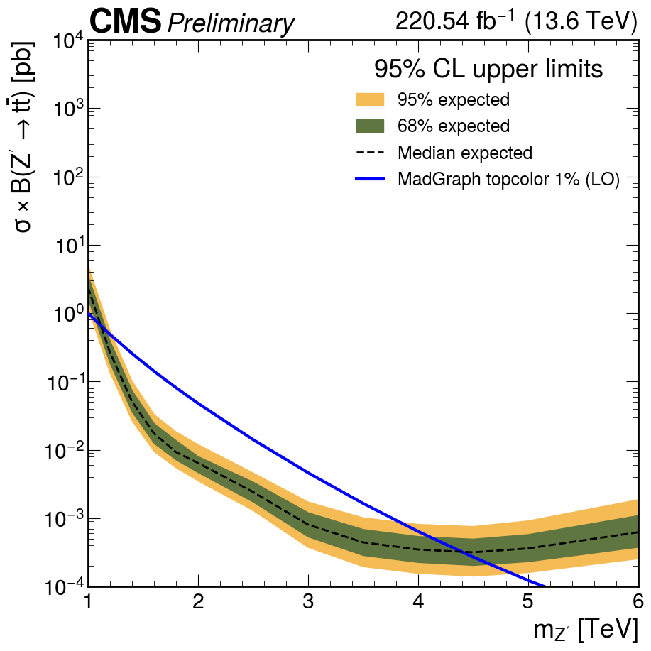

# Updates, 2024/2025 limits

## Date

2026-06-25

## Source

`research-notes/meetings/ttbarhad/2026/06/meeting_2026_06_25_thu.md`

Additional context:
`research-notes/topics/recomb_ttag_2dalphabet_limit_and_norm_comparison.md`

## Presented

### 1. 0.5% mistag working point — low event count

- Now operating at **0.5% mistag** (`tight`), changed from **1%** (`medium`).
- Event counts went **down** after this change; still investigating reason.

### 2. Topcolor σ×B — question about the correct theory cross section

13.6 TeV leptophobic-topcolor (Harris–Jain Model IV) scan, MG5 2.9.27 + `topBSM_UFO`.

**Which theory σ×B should be used for the Z′→tt̄ overlay and mass crossing?**

Looks like the XSDB cross sections are off .. what source was used in Run II for the limits?

### 3. 2024 — 10% and 30% Z′ (blinded, snapshot Asimov)

Both widths now cross (ratio-anchored): **10% ≈ 5.73 TeV**, **30% ≈ 7.08 TeV**.

### 4. r=1 normalisation study

This should ideally be invariant to how I scale the signals initially. But setting
`r=1 → 1 pb` makes the fit unstable because it floors at $10^-3$. 

Initialising the signal strength at zero also helps the fits: the current
`ttbar.py` defaults to `--rInit 0 --rMin 0` (previously `rMin` was set to `-6`), because starting from `r=1` and
allowing negative `r` previously caused fit failures and negative-yield-like
instabilities. 

### 5. 2025 added and 2024+2025 combined

Real 2025 data eras C–G (**110.59 fb⁻¹**) + 2024 MC lumi-scaled ×1.00582.

- **F-test:** `fwd2025 = 2×1` confirmed; `cen2025` : Struggling to determine the correct TF, f-test results are saying 0x0 but that is not physical. Checking. 
- **Combined `cen2425`** converges after loosening the tt̄ rate prior 20% → 30%. (this is consistent with RunII AN)
- Full 1% mass scans were completed for 2025 standalone and 2024+2025 combined.
- I remove the 'fake' top tag scale factors for now. (We plan to float it, not implemented yet)

Expected 1% exclusion crossings after removing the floating `ttagSF`:

| Fit | Theory reference | Expected crossing |
| --- | --- | --- |
| 2025 standalone | XSDB/"Par" LO | 4.82 TeV |
| 2025 standalone | MadGraph topcolor LO | 4.26 TeV |
| 2024+2025 combined | MadGraph topcolor LO | 4.40 TeV |

> The 2025 postfit projection still carries the pre-fix `138 fb⁻¹ (13 TeV)`
> placeholder label; the actual 2025 luminosity is 110.59 fb⁻¹ at 13.6 TeV
> (plotter label fixed afterward).

## Action Items

| Item | Status |
| --- | --- |
| Track down the 0.5%-mistag event-count drop | In progress |
| Extend 2025 and 2024+2025 scans to 10% and 30% widths | In Progress |
| Re-run 2025 cen F-test to determine correct TF | Open |
