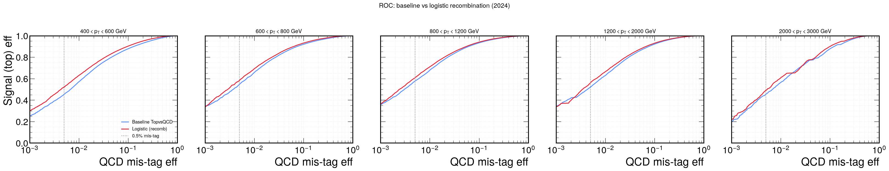
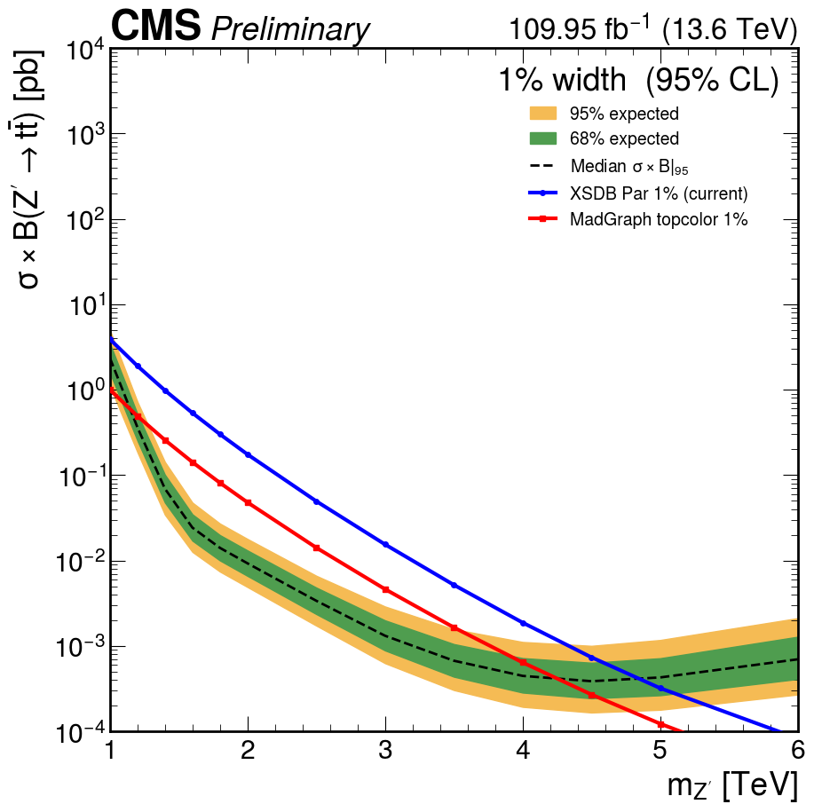
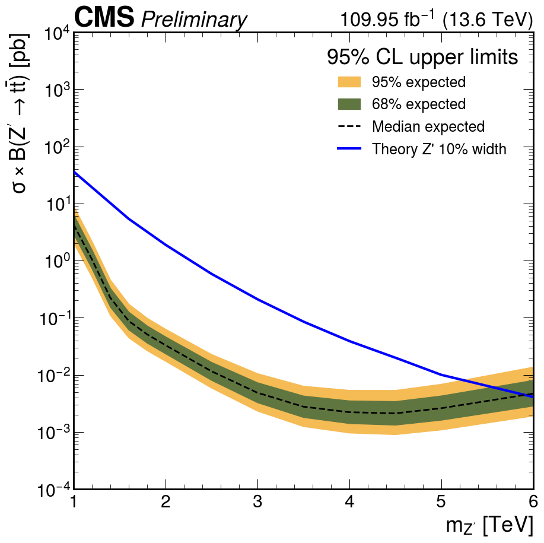
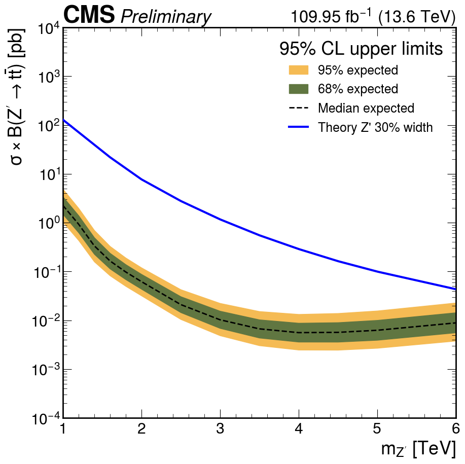
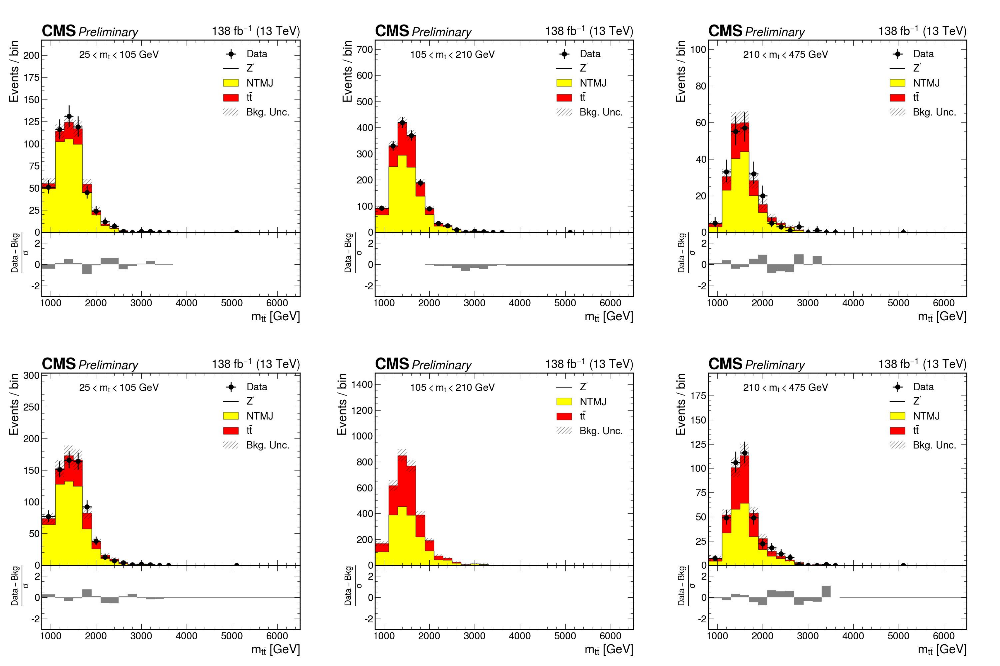

# Tagger Recombination, Topcolor σ×B, 2024 10/30%, 2025 Added

## Date

2026-06-25

## Source

`research-notes/meetings/ttbarhad/2026/06/meeting_2026_06_25_thu.md`

## Presented

### 1. Low event count — under investigation

- Now operating at **0.5% mistag** (`tight`), changed from **1%** (`medium`).
- Event counts went **down**; cause still being investigated.

### 2. GloParTv3 — proposal to use the recombination top-tagger

Reference: [CMS GlobalParT TWiki](https://twiki.cern.ch/twiki/bin/view/CMS/GlobalParT).
Switch the boosted-top tag from the fixed baseline ratio to a learned recombination.

Baseline — one fixed ratio of the heads:

$$D_{\mathrm{top}}=\frac{P_{\mathrm{TopbWqq}}+P_{\mathrm{TopbWq}}}{P_{\mathrm{TopbWqq}}+P_{\mathrm{TopbWq}}+P_{\mathrm{QCD}}}$$

Recombination — learned, **per-$p_T$** logistic weights over all 7 heads:

$$s=\sigma\!\Big(B_0(p_T)+\textstyle\sum_k A_k(p_T)\,\log(\mathrm{head}_k+\varepsilon)\Big)$$

It adds weight on the heavy-flavour $X$ heads and an asymmetric `TopbWqq:TopbWq`
split (the baseline forces 1:1, QCD-only denominator), giving **+3–4% absolute
signal efficiency at the same 0.5% QCD mistag** while staying mass-decorrelated.

### 3. Topcolor σ×B (MadGraph) — why the "Par" masses are wrong

13.6 TeV leptophobic-topcolor (Harris–Jain Model IV) scan, MG5 2.9.27 + `topBSM_UFO`.

- The official **"Par" sample cross section is the wrong overlay**: its width is
  **hand-set**, so σ×B **∝ 1/width**. The real topcolor benchmark has σ×B
  **∝ width**, with steep finite-width high-mass growth.
- The MadGraph topcolor absolute sits **~3–5× below** the Par values at every width.

| Width | ratio-anchored crossing | pure topcolor crossing |
| --- | --- | --- |
| 1% | 4.84 TeV | 4.25 TeV |
| 10% | 5.73 TeV | 5.09 TeV |
| 30% | 7.08 TeV | 5.92 TeV |

### 4. 2024 — 10% and 30% Z′ (blinded, snapshot Asimov)

Both widths now cross (ratio-anchored): **10% ≈ 5.73 TeV**, **30% ≈ 7.08 TeV**.

### 5. 2025 added (and combined 2024+2025)

Real 2025 data eras C–G (**110.59 fb⁻¹**) + 2024 MC lumi-scaled ×1.00582, recomb tagger.

- **F-test:** `fwd2025 = 2×1` confirmed; `cen2025` degenerate (no order beats 0×0,
  confounded by the central tt̄ over-normalization) — held at 2×2.
- **Combined `cen2425`** converges after loosening the tt̄ rate prior 20% → 30%.
- Preliminary blinded r₉₅ (ZPrime4000): cen2025 0.27, fwd2025 0.44,
  **cen2425 0.167** — combining 2024+2025 tightens the central reach.

> The 2025 postfit projection still carries the pre-fix `138 fb⁻¹ (13 TeV)`
> placeholder label; the actual 2025 luminosity is 110.59 fb⁻¹ at 13.6 TeV
> (plotter label fixed afterward).

## Decisions And Requests

- Adopt the GloParTv3 recombination tagger as the default boosted-top tag (+3–4% eff).
- Settle the topcolor overlay anchoring (ratio-anchored vs pure topcolor) via a
  Run-2 reproduction test.

## Action Items

| Item | Status |
| --- | --- |
| Track down the 0.5%-mistag event-count drop | In progress |
| Switch tag to recombination tagger by default | Open |
| Resolve topcolor overlay anchoring (Run-2 reproduction test) | Open |
| Full combined 2024+2025 mass scan | Open |
| Re-run 2025 cen F-test after over-normalization fix | Open |
